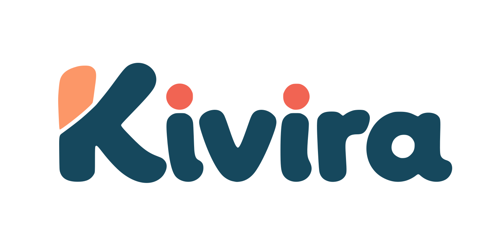

<div align="center">

  

  <p align="center">
    <strong>Plataforma Educacional Gamificada com Mecanismos de Revelação Progressiva</strong>
  </p>

  <p align="center">
    Projeto desenvolvido como Trabalho de Conclusão de Curso (TCC) para o curso de <strong>Ciência da Computação</strong>.
  </p>

  <p align="center">
    
    
    
    
  </p>

</div>

---

## 📖 Sobre o Projeto

O **Kivira** é uma plataforma web criada para tornar o processo de aprendizagem infantil dinâmico, interativo e visual. Inspirada nos princípios pedagógicos do sistema LUK, a aplicação une gamificação e acompanhamento pedagógico através de atividades cognitivas estruturadas.

A plataforma atende a dois perfis principais:
- **Educadores (Professores):** Gestão de salas, acompanhamento de métricas, turmas e atividades.
- **Alunos:** Interface imersiva e acessível focada em jogos educativos e desafios interativos.

---

## 🎨 Identidade Visual

A interface foi desenhada visando acessibilidade, contraste suave e engajamento visual:

| Paleta | Cor Hex | Uso Principal |
| :--- | :--- | :--- |
|  | `#eb7561` | Botões de ação primária, destaques e call-to-actions |
|  | `#214a5a` | Sidebar, títulos principais, contrastes e textos |
|  | `#f5e6d3` | Fundo geral da aplicação e superfícies suaves |
|  | `#eeb37f` | Badges, indicadores e elementos secundários |
---

## 📱 Módulos e Telas Implementadas

### 🔐 Autenticação & Acesso
* **Tela de Login:** Autenticação via JWT com redirecionamento dinâmico conforme o perfil (`professor` ou `aluno`).
* **Tela de Cadastro:** Registro com validações de consistência e divisão segura entre perfil e credenciais de acesso.

### 📊 Painel do Professor (Dashboard)
* **Resumo de Métricas:** Contadores em tempo real de turmas ativas, atividades criadas e alunos participantes.
* **Ações Rápidas:** Criação e gerenciamento de salas e atividades pedagógicas.
* **Listagem de Turmas:** Visão geral das turmas recentes com status e contadores de engajamento.

### 🎮 Ambiente do Aluno (Mecânica Gamificada)
* **Tabuleiro Interativo:** Mecânica baseada no sistema pedagógico LUK com animações 3D de inversão (`flipInY`).
* **Interação Híbrida:** Suporte completo a **Drag and Drop** (arrastar e soltar) nativo e seleção facilitada por clique.
* **Modo Dashboard:** Visualização fluida em tela única, otimizada para o público infantil sem barras de rolagem.

---

## 🛠️ Tecnologias Utilizadas

### Frontend
* **React** (Componentização SPA)
* **Vite** (Build tool e ambiente de desenvolvimento)
* **Tailwind CSS v4 & daisyUI** (Design system e responsividade)
* **React Router Dom** (Roteamento e proteção de páginas)
* **Animate.css** (Feedbacks visuais e animações físicas)

### Backend
* **FastAPI** (Python 3.12+)
* **SQLAlchemy** (ORM para persistência e modelagem relacional)
* **PyMySQL & Cryptography** (Driver de conexão com suporte a SSL)
* **Python-Jose & Passlib/Bcrypt** (Criptografia de senhas e tokens JWT)
* **Uvicorn** (Servidor ASGI de alta performance)

### Banco de Dados
* **MySQL 8.4** (Hospedado em nuvem)

---

## 🚀 Como Executar o Projeto Localmente

### Pré-requisitos
* **Node.js** (v18+)
* **Python** (v3.10+)
* **Git**

### 1. Clonar o repositório
```bash
git clone [https://github.com/seu-usuario/kivira.git](https://github.com/seu-usuario/kivira.git)
cd kivira